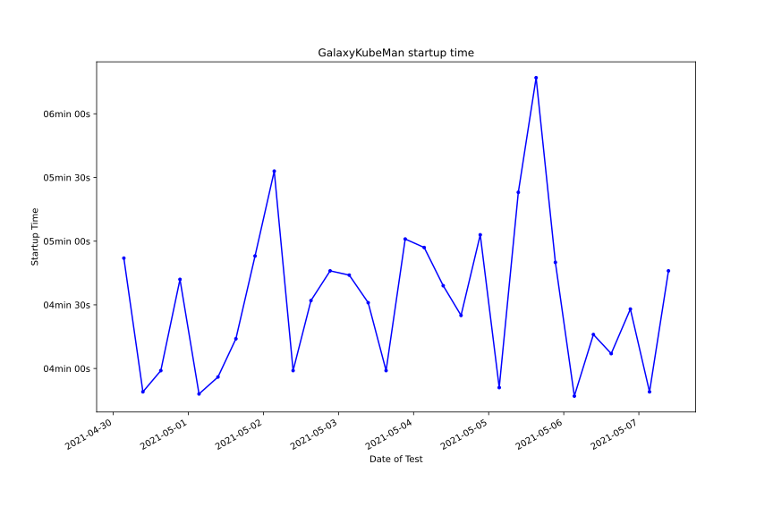

# Automated Tests for Galaxy on Kubernetes Stacks
## Galaxy on GKE deployed via GalaxyKubeMan (AnVIL)
### Deployment Testing
Twice a day, [GalaxyKubeMan (GKM)](https://github.com/galaxyproject/galaxykubeman-helm) is deployed on GKE, mimicking an AnVIL deployment. The purpose of these tests is to provide reasonable confidence that Galaxy is launchable on the AnVIL everyday.

Below is a plot summarizing successful deployments and GKM install times.
<a href="https://htmlpreview.github.io/?https://github.com/almahmoud/anvil-misc/blob/master/reports/anvil/deployments.html">Click here</a> or on the image for more details.

### Tool Testing
After each successful deployment, automated tool tests are also run against the instance. These serve as an end-to-end-like test for Galaxy, providing confidence that Galaxy is not only launchable but functional. These tests cycle on a weekly basis through the entire suite of tools installed by default on AnVIL, providing reasonable confidence that the tools encountered by most users remain functional, and automating the detection and reporting of tools breaking.

Latest tool tests for each chunk:

<table id="anviltools"><thead><tr><th>Chunk ID</th><th>Tool List</th><th>Latest report</th><th>Previous report</th></tr></thead><tbody><tr><td>0</td><td><a href="https://github.com/almahmoud/anvil-misc/blob/master/reports/anvil/tool-tests/gxy-auto-04-19-03-07-57/tools.yaml">Toolset</a></td><td><a href="https://htmlpreview.github.io/?https://github.com/almahmoud/anvil-misc/blob/master/reports/anvil/tool-tests/gxy-auto-04-19-03-07-57/results.html">Mon Apr 19 03:19:27 2021</a></td><td><a href="https://htmlpreview.github.io/?https://github.com/almahmoud/anvil-misc/blob/master/reports/anvil/tool-tests/gxy-auto-04-12-03-08-47/results.html">Mon Apr 12 03:20:57 2021</a></td></tr><tr><td>1</td><td><a href="https://github.com/almahmoud/anvil-misc/blob/master/reports/anvil/tool-tests/gxy-auto-04-19-15-03-32/tools.yaml">Toolset</a></td><td><a href="https://htmlpreview.github.io/?https://github.com/almahmoud/anvil-misc/blob/master/reports/anvil/tool-tests/gxy-auto-04-19-15-03-32/results.html">Mon Apr 19 15:16:25 2021</a></td><td><a href="https://htmlpreview.github.io/?https://github.com/almahmoud/anvil-misc/blob/master/reports/anvil/tool-tests/gxy-auto-04-12-15-05-28/results.html">Mon Apr 12 15:17:22 2021</a></td></tr><tr><td>2</td><td><a href="https://github.com/almahmoud/anvil-misc/blob/master/reports/anvil/tool-tests/gxy-auto-04-20-03-06-20/tools.yaml">Toolset</a></td><td><a href="https://htmlpreview.github.io/?https://github.com/almahmoud/anvil-misc/blob/master/reports/anvil/tool-tests/gxy-auto-04-20-03-06-20/results.html">Tue Apr 20 03:23:11 2021</a></td><td><a href="https://htmlpreview.github.io/?https://github.com/almahmoud/anvil-misc/blob/master/reports/anvil/tool-tests/gxy-auto-04-13-03-09-06/results.html">Tue Apr 13 03:20:29 2021</a></td></tr><tr><td>3</td><td><a href="https://github.com/almahmoud/anvil-misc/blob/master/reports/anvil/tool-tests/gxy-auto-04-20-15-03-38/tools.yaml">Toolset</a></td><td><a href="https://htmlpreview.github.io/?https://github.com/almahmoud/anvil-misc/blob/master/reports/anvil/tool-tests/gxy-auto-04-20-15-03-38/results.html">Tue Apr 20 15:19:16 2021</a></td><td><a href="https://htmlpreview.github.io/?https://github.com/almahmoud/anvil-misc/blob/master/reports/anvil/tool-tests/gxy-auto-04-13-15-03-40/results.html">Tue Apr 13 15:16:08 2021</a></td></tr><tr><td>4</td><td><a href="https://github.com/almahmoud/anvil-misc/blob/master/reports/anvil/tool-tests/gxy-auto-04-21-03-06-50/tools.yaml">Toolset</a></td><td><a href="https://htmlpreview.github.io/?https://github.com/almahmoud/anvil-misc/blob/master/reports/anvil/tool-tests/gxy-auto-04-21-03-06-50/results.html">Wed Apr 21 03:22:25 2021</a></td><td><a href="https://htmlpreview.github.io/?https://github.com/almahmoud/anvil-misc/blob/master/reports/anvil/tool-tests/gxy-auto-04-14-03-05-41/results.html">Wed Apr 14 03:17:10 2021</a></td></tr><tr><td>5</td><td><a href="https://github.com/almahmoud/anvil-misc/blob/master/reports/anvil/tool-tests/gxy-auto-04-21-15-03-35/tools.yaml">Toolset</a></td><td><a href="https://htmlpreview.github.io/?https://github.com/almahmoud/anvil-misc/blob/master/reports/anvil/tool-tests/gxy-auto-04-21-15-03-35/results.html">Wed Apr 21 15:20:03 2021</a></td><td><a href="https://htmlpreview.github.io/?https://github.com/almahmoud/anvil-misc/blob/master/reports/anvil/tool-tests/gxy-auto-04-14-15-03-47/results.html">Wed Apr 14 15:19:52 2021</a></td></tr><tr><td>6</td><td><a href="https://github.com/almahmoud/anvil-misc/blob/master/reports/anvil/tool-tests/gxy-auto-04-22-09-06-31/tools.yaml">Toolset</a></td><td><a href="https://htmlpreview.github.io/?https://github.com/almahmoud/anvil-misc/blob/master/reports/anvil/tool-tests/gxy-auto-04-22-09-06-31/results.html">Thu Apr 22 09:23:35 2021</a></td><td><a href="https://htmlpreview.github.io/?https://github.com/almahmoud/anvil-misc/blob/master/reports/anvil/tool-tests/gxy-auto-04-22-04-07-10/results.html">Thu Apr 22 04:22:06 2021</a></td></tr><tr><td>7</td><td><a href="https://github.com/almahmoud/anvil-misc/blob/master/reports/anvil/tool-tests/gxy-auto-04-22-21-04-36/tools.yaml">Toolset</a></td><td><a href="https://htmlpreview.github.io/?https://github.com/almahmoud/anvil-misc/blob/master/reports/anvil/tool-tests/gxy-auto-04-22-21-04-36/results.html">Thu Apr 22 21:20:49 2021</a></td><td><a href="https://htmlpreview.github.io/?https://github.com/almahmoud/anvil-misc/blob/master/reports/anvil/tool-tests/gxy-auto-04-22-15-01-59/results.html">Thu Apr 22 15:14:25 2021</a></td></tr><tr><td>8</td><td><a href="https://github.com/almahmoud/anvil-misc/blob/master/reports/anvil/tool-tests/gxy-auto-04-23-09-06-53/tools.yaml">Toolset</a></td><td><a href="https://htmlpreview.github.io/?https://github.com/almahmoud/anvil-misc/blob/master/reports/anvil/tool-tests/gxy-auto-04-23-09-06-53/results.html">Fri Apr 23 09:22:23 2021</a></td><td><a href="https://htmlpreview.github.io/?https://github.com/almahmoud/anvil-misc/blob/master/reports/anvil/tool-tests/gxy-auto-04-23-03-08-50/results.html">Fri Apr 23 03:25:47 2021</a></td></tr><tr><td>9</td><td><a href="https://github.com/almahmoud/anvil-misc/blob/master/reports/anvil/tool-tests/gxy-auto-04-23-21-04-38/tools.yaml">Toolset</a></td><td><a href="https://htmlpreview.github.io/?https://github.com/almahmoud/anvil-misc/blob/master/reports/anvil/tool-tests/gxy-auto-04-23-21-04-38/results.html">Fri Apr 23 21:18:01 2021</a></td><td><a href="https://htmlpreview.github.io/?https://github.com/almahmoud/anvil-misc/blob/master/reports/anvil/tool-tests/gxy-auto-04-23-15-02-11/results.html">Fri Apr 23 15:14:24 2021</a></td></tr><tr><td>10</td><td><a href="https://github.com/almahmoud/anvil-misc/blob/master/reports/anvil/tool-tests/gxy-auto-04-17-03-05-07/tools.yaml">Toolset</a></td><td><a href="https://htmlpreview.github.io/?https://github.com/almahmoud/anvil-misc/blob/master/reports/anvil/tool-tests/gxy-auto-04-17-03-05-07/results.html">Sat Apr 17 03:22:45 2021</a></td><td><a href="https://htmlpreview.github.io/?https://github.com/almahmoud/anvil-misc/blob/master/reports/anvil/tool-tests/gxy-auto-04-10-03-06-22/results.html">Sat Apr 10 03:19:28 2021</a></td></tr><tr><td>11</td><td><a href="https://github.com/almahmoud/anvil-misc/blob/master/reports/anvil/tool-tests/gxy-auto-04-17-15-03-35/tools.yaml">Toolset</a></td><td><a href="https://htmlpreview.github.io/?https://github.com/almahmoud/anvil-misc/blob/master/reports/anvil/tool-tests/gxy-auto-04-17-15-03-35/results.html">Sat Apr 17 15:19:20 2021</a></td><td><a href="https://htmlpreview.github.io/?https://github.com/almahmoud/anvil-misc/blob/master/reports/anvil/tool-tests/gxy-auto-04-10-15-03-42/results.html">Sat Apr 10 15:15:56 2021</a></td></tr><tr><td>12</td><td><a href="https://github.com/almahmoud/anvil-misc/blob/master/reports/anvil/tool-tests/gxy-auto-04-08-00-19-13/tools.yaml">Toolset</a></td><td><a href="https://htmlpreview.github.io/?https://github.com/almahmoud/anvil-misc/blob/master/reports/anvil/tool-tests/gxy-auto-04-08-00-19-13/results.html">Thu Apr 08 00:30:56 2021</a></td><td><a href="N/A">N/A</a></td></tr><tr><td>13</td><td><a href="https://github.com/almahmoud/anvil-misc/blob/master/reports/anvil/tool-tests/gxy-auto-04-18-15-03-26/tools.yaml">Toolset</a></td><td><a href="https://htmlpreview.github.io/?https://github.com/almahmoud/anvil-misc/blob/master/reports/anvil/tool-tests/gxy-auto-04-18-15-03-26/results.html">Sun Apr 18 15:15:17 2021</a></td><td><a href="https://htmlpreview.github.io/?https://github.com/almahmoud/anvil-misc/blob/master/reports/anvil/tool-tests/gxy-auto-04-11-15-03-35/results.html">Sun Apr 11 15:16:47 2021</a></td></tr></tbody></table>
